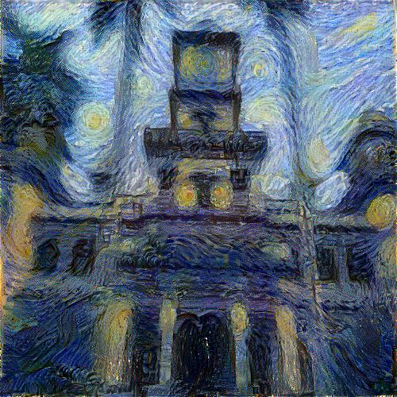
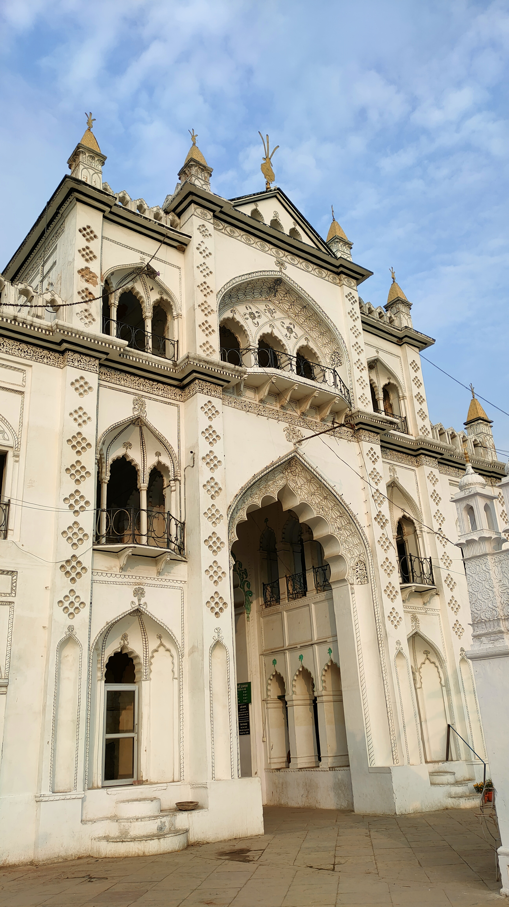

# Neural Style Transfer Project

## Overview

This project implements neural style transfer using TensorFlow and a pre-trained VGG19 model. The goal is to combine the content of one image with the artistic style of another, creating visually appealing results.

## Demo

<table>
<tr>
	<th>Sl no.</th>
	<th>Content</th>
	<th>Style</th>
	<th>Output</th>
</tr>
<tr>
	<td><a id="first">1</a></td>
	<td></td>
	<td></td>
	<td></td>
</tr>
<tr>
	<td><a id="second">2</a></td>
	<td></td>
	<td></td>
	<td></td>
</tr>
<tr>
	<td><a id="third">3</a></td>
	<td></td>
	<td></td>
	<td></td>
</tr>
</table>

## Installation

1. Clone the repository:

    ```bash
    git clone https://github.com/yash-shimpi/DashToon-Generative-AI-Engineer
    ```

2. Install the required dependencies:

    ```bash
    pip install -r requirements.txt
    ```

3. Download the pre-trained VGG19 weights exluding top layer file from [link](https://storage.googleapis.com/tensorflow/keras-applications/vgg19/vgg19_weights_tf_dim_ordering_tf_kernels_notop.h5) and place it in the project root directory. (optional, else used Keras API)

## Usage

1. Modify the `content_path` and `style_path` variables in the script to specify the paths of your content and style images.

2. Run the script:

    ```bash
    python3 notebook_script.py
    ```

3. View the output images and the training progress in the console.

## Project Structure

- `notebook_script.py`: Main script for style transfer.
- `notebook.ipynb`: Main Jupyter notebook for style transfer.
- `README.md`: Project documentation.
- `requirements.txt`: List of project dependencies.
- `vgg19_weights_tf_dim_ordering_tf_kernels_notop.h5`: Pre-trained VGG19 weights file (downloaded separately).

## Dependencies

- TensorFlow
- NumPy
- Matplotlib
- OpenCV
- PIL (Python Imaging Library)

Install dependencies using:

```bash
pip install -r requirements.txt
